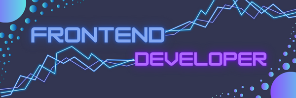

 

<!-- 

 
 
 -->

  

  My name is Fabian, I'm 17 years old and I want to become a software engineer in the future.  
  He is interested in designing and creating websites. I like learning new technologies. 

Stuff I know :brain:
--------------------------------------

  

Want I learn :monocle_face:
--------------------------------------

  

Github Stats
---------------------------------------

 

